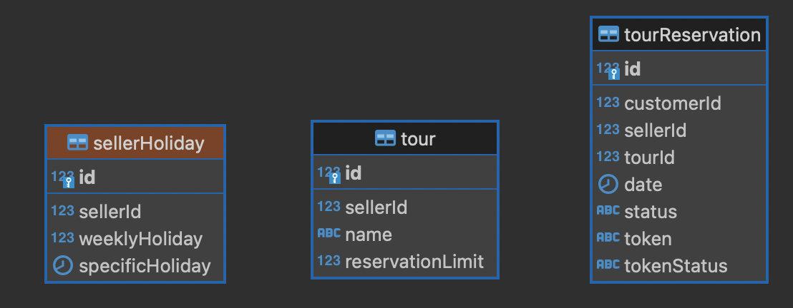
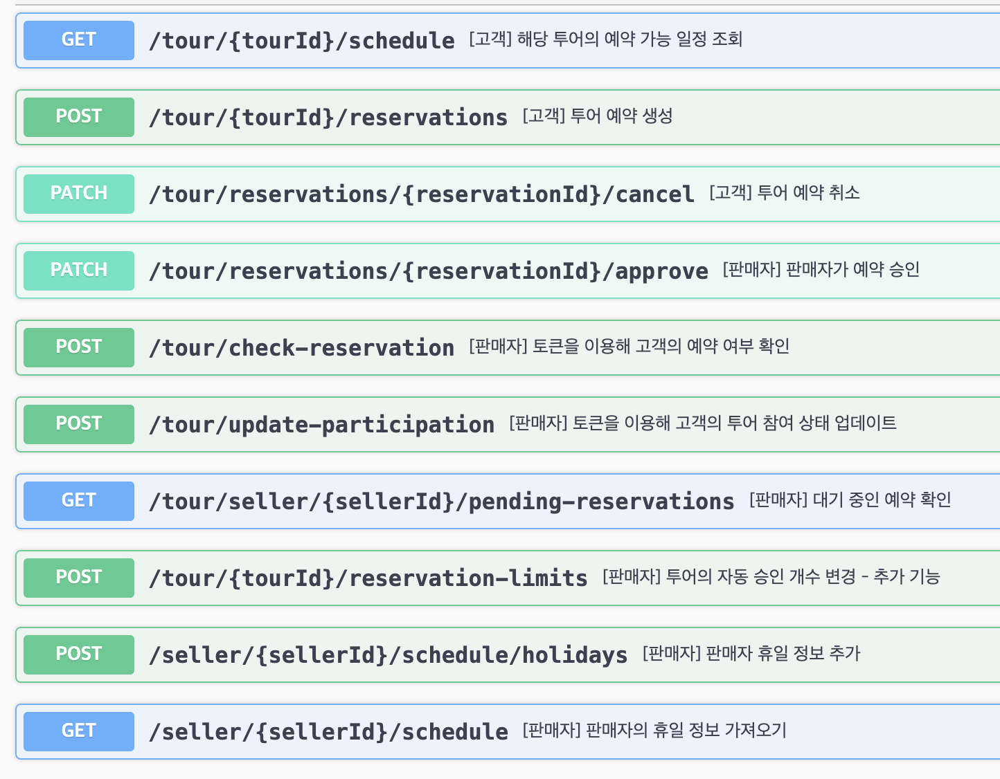
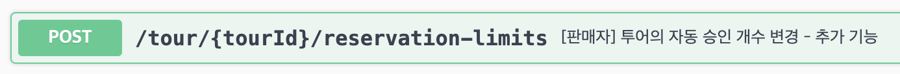

## Development Environment

- Language: Node.js
- Database: Mysql 8.0
- Cache: Redis
- Web application framework: NestJs
- ORM: TypeORM
- Docker


## Start Guide

npm 패키지 설치하기
```bash
$ npm install
```
MySQL, Redis는 컨테이너 환경에서 실행합니다.


```bash
$ docker-compose up -d
```
개발 모드로 앱을 실행합니다.
```bash
$ npm run start:dev
```


## ERD
앱을 실행하면 자동으로 entity파일과 동기화되어 테이블이 생성됩니다.
(따로 SQL Query로 테이블을 생성할 필요가 없습니다.) 



## Swagger에 API 관련 명세가 정리되어있습니다.

http://localhost:3000/api/docs/


## 요구사항 이외에 경험상 필요했던 기능

- 자동 승인되는 투어 예약의 개수를 조정하는 기능 추가

 판매자가 하루 동안 받을 수 있는 투어 예약의 한도를 유연하게 관리할 수 있게 해주는 기능입니다. 이 API는 판매자가 시즌, 수요, 또는 다른 비즈니스 요구 사항에 따라 예약 한도를 조절할 수 있게 해줍니다. 

 